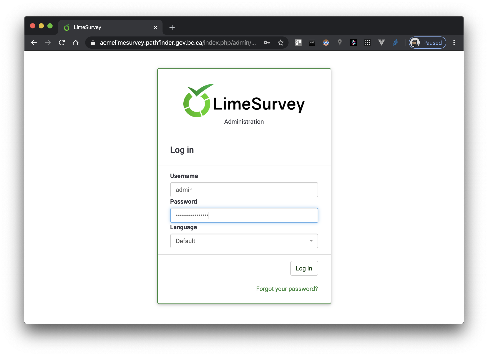
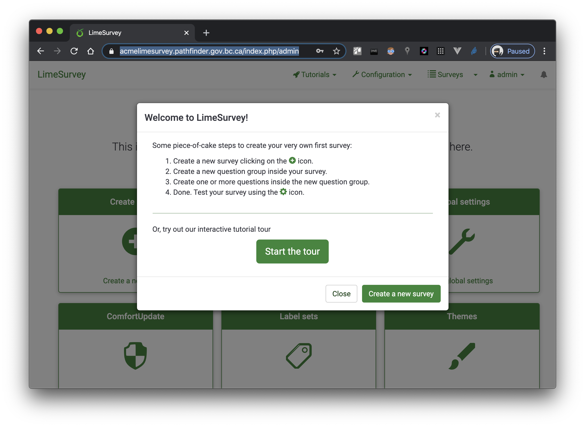

# NRM LimeSurvey

OpenShift templates for LimeSurvey, used within Natural Resources Ministries and ready for deployment on [OpenShift](https://www.openshift.com/).  [LimeSurvey](https://www.limesurvey.org/) is an open-source PHP application with a relational database for persistent data.  MariaDB was initially chosen over the usual CSI Lab PostgreSQL due to LimeSurvey supporting DB backup out-of-the-box with MariaDB; but with the addition of [Backup Containers](https://github.com/BCDevOps/backup-container), we have now standardized on PostgreSQL.


## Prerequisites


## Files

* [OpenShift LimeSurvey app template](openshift/limesurvey-postgresql.dc.json) for LimeSurvey PHP application, with PostgreSQL Database
* [OpenShift Database service template](openshift/postgresql.dc.json) for a PostgreSQL Database
* [LimeSurvey Configuration](application/config/config-postgresql.php) used during initial install of LimeSurvey with a PostgreSQL Datbase.  It contains NRM-specific details such as the SMTP host and settings, and reply-to email addresses; most importantly, it integrates with the OpenShift pattern of exposing DB parameters as environmental variables in the shell.  It is automatically deployed to the running container from the application's OpenShift ConfigMap.

## Build

To ensure we can build off a known version of LimeSurvey, we build images based upon the [git submodule](./LimeSurvey).

> oc -n b7cg3n-tools new-build openshift/php:7.1~https://github.com/LimeSurvey/LimeSurvey.git --name=limesurvey-app

Tag with the correct release version, matching the major-minor tag at the source [repo](https://github.com/LimeSurvey/LimeSurvey/tags).  For example:

> oc -n b7cg3n-tools tag limesurvey-app:latest limesurvey-app:v3.15`

NOTE: To update this LimeSurvey [git submodule](https://git-scm.com/book/en/v2/Git-Tools-Submodules) from the [upstream repo](https://github.com/LimeSurvey/LimeSurvey):

> git submodule update --remote LimeSurvey

## Deploy

### Database

Deploy the DB using the correct SURVEY_NAME parameter (e.g. an acronym that is prefixed to `limesurvey`):

> oc -n &lt;project&gt; new-app --file=./openshift/postgresql.dc.json -p SURVEY_NAME=&lt;survey&gt;limesurvey

All DB deployments are based on the out-of-the-box [OpenShift Database Image](https://docs.openshift.com/container-platform/3.11/using_images/db_images/postgresql.html).

#### Reset the Database Deployment

To re-deploy *just* the database, first delete the deployed objects from the last run, with the correct SURVEY_NAME, such as:

> oc -n &lt;project&gt; delete secret/xyzlimesurvey-postgresql dc/&lt;survey&gt;limesurvey-postgresql svc/&lt;survey&gt;limesurvey-postgresql

The Database Volume is left intact, but to delete it:  
`oc -n <project> delete pvc/<survey>limesurvey-postgresql`  

### Application

Deploy the Application using the survey-specific parameter (e.g. `<survey>limesurvey`):

> oc -n &lt;project&gt; new-app --file=./openshift/limesurvey-postgresql.dc.json -p SURVEY_NAME=&lt;survey&gt;limesurvey -p ADMIN_EMAIL=&lt;Email.Address&gt;@gov.bc.ca

NOTE: The ADMIN_EMAIL is required, and you  override the ADMIN_USER and ADMIN_NAME. The ADMIN_PASSWORD is automatically generated by the template; be sure to note the generated password (shown in the output of this command on the screen).

#### Reset the Application Deployment

To redeploy *just* the application, first delete the deployed objects from the last run, with the correct SURVEY_NAME, such as:  
> oc -n &lt;project&gt; delete cm/&lt;survey&gt;limesurvey-app-config secret/&lt;survey&gt;limesurvey-admin-cred dc/&lt;survey&gt;limesurvey-app svc/&lt;survey&gt;limesurvey route/&lt;survey&gt;limesurvey

The Uploads PVC is left intact, but to delete it:  
`oc -n <project> delete pvc/<survey>limesurvey-app-uploads`

## Perform LimeSurvey installation

Run the [command line install](https://manual.limesurvey.org/Installation_using_a_command_line_interface_(CLI)) via `oc rsh`, with the correct SURVEY_NAME and credentials:

> oc -n &lt;project&gt; rsh $(oc -n &lt;project&gt; get pods | grep &lt;survey&gt;limesurvey-app- | grep -v deploy | grep Running | head -n 1 | awk '{print $1}')

> cd application/commands/
php console.php install ${ADMIN_USER} ${ADMIN_PASSWORD} ${ADMIN_NAME} ${ADMIN_EMAIL}  

NOTE that the ${ADMIN_**} text is exactly as written, as the app has access to these environment variables (set during the `new-app` step).

### Synchronize the Uploads folder

As OpenShift pods can be subsequently redeployed at any time, we synchronize all `/upload` folders and files onto our mounted PersistentVolume. Once a pod is running, use `oc rsync` with the correct SURVEY_NAME such as:

> oc -n &lt;project&gt; rsync upload $(oc -n &lt;project&gt; get pods | grep &lt;survey&gt;limesurvey-app- | grep -v deploy | grep Running | head -n 1 | awk '{print $1}'):/var/lib/limesurvey

This is only required when upgrading LimeSurvey (i.e. the new version adds/modifies web assets), and need only be done once per replica set (i.e. `rsh` into one pod, rsync, and then all replicas will see this change).

TODO back up as part of 'backup containers' for user uploaded files?

### Log into the LimeSurvey installation

Once the application has finished the initial install you may log in as the admin user (created in either of the two methods above).  Use the correct SURVEY_NAME in the URL:
`https://<survey>limesurvey.pathfinder.gov.bc.ca/index.php/admin`

## Example Deploy

For a survey with the acronym `acme`, deployed in the project namespace `b7cg3n-deploy`.

<details><summary>Deployment Steps</summary>

### Database Deployment

> oc -n b7cg3n-deploy new-app --file=./openshift/postgresql.dc.json -p SURVEY_NAME=acmelimesurvey

```bash
--> Deploying template "b7cg3n-deploy/nrms-postgresql-dc" for "./openshift/postgresql.dc.json" to project b7cg3n-deploy

     * With parameters:
        * Survey Name=acmelimesurvey
        * Memory Limit=512Mi
        * PostgreSQL Connection Password=supersecret # generated
        * Database Volume Capacity=1Gi

--> Creating resources ...
    secret "acmelimesurvey-postgresql" created
    persistentvolumeclaim "acmelimesurvey-postgresql" created
    deploymentconfig.apps.openshift.io "acmelimesurvey-postgresql" created
    service "acmelimesurvey-postgresql" created
--> Success
    Application is not exposed. You can expose services to the outside world by executing one or more of the commands below:
     'oc expose svc/acmelimesurvey-postgresql' 
    Run 'oc status' to view your app.
```

### App Deployment

> oc -n b7cg3n-deploy new-app --file=./openshift/limesurvey-postgresql.dc.json -p SURVEY_NAME=acmelimesurvey -p ADMIN_EMAIL=Wile.E.Coyote@gov.bc.ca ADMIN_NAME="ACME LimeSurvey Administrator"

```bash
--> Deploying template "b7cg3n-deploy/nrms-limesurvey-postgresql-dc" for "./openshift/limesurvey-postgresql.dc.json" to project b7cg3n-deploy

     * With parameters:
        * Namespace=b7cg3n-tools
        * Image Stream=limesurvey-app
        * Version of LimeSurvey=v3.15
        * LimeSurvey Acronym=acmelimesurvey
        * Upload Folder size=1Gi
        * Administrator Account Name=admin
        * Administrator Display Name=Administrator
        * Administrator Passwords=4QUWfks3RJCuweoF # generated
        * Administrator Email Address=Wile.E.Coyote@gov.bc.ca
        * CPU_LIMIT=500m
        * MEMORY_LIMIT=1Gi
        * CPU_REQUEST=100m
        * MEMORY_REQUEST=512Mi
        * REPLICA_MIN=2
        * REPLICA_MAX=3

--> Creating resources ...
    configmap "acmelimesurvey-app-config" created
    secret "acmelimesurvey-admin-cred" created
    persistentvolumeclaim "acmelimesurvey-app-uploads" created
    deploymentconfig.apps.openshift.io "acmelimesurvey-app" created
    service "acmelimesurvey" created
    route.route.openshift.io "acmelimesurvey" created
--> Success
    Access your application via route 'acmelimesurvey.pathfinder.gov.bc.ca' 
    Run 'oc status' to view your app.
```

### Perform one-time setup

After 20 - 30 seconds, at least one pod should be up.  Verify that pods are running:

> oc -n b7cg3n-deploy get pods | grep acmelimesurvey-app- | grep -v deploy | grep Running | awk '{print $1}'

```bash
acmelimesurvey-app-1-5rxkd
acmelimesurvey-app-1-jg2k2
```

Once you see running pods:

> oc -n b7cg3n-deploy rsh $(oc -n b7cg3n-deploy get pods | grep acmelimesurvey-app- | grep -v deploy | grep Running | head -n 1 | awk '{print $1}')

In this shell:
> cd application/commands/  
> php console.php install ${ADMIN_USER} ${ADMIN_PASSWORD} ${ADMIN_NAME} ${ADMIN_EMAIL}

```bash
    Connecting to database...
    Using connection string pgsql:host=acmelimesurvey-postgresql;port=5432;dbname=acmelimesurvey
    Creating tables...
    Creating admin user...
    All done!
```

Type `exit` to exit the remote shell.

### Synchronize the shared uploads folder

> oc -n b7cg3n-deploy rsync upload $(oc -n b7cg3n-deploy get pods | grep acmelimesurvey-app- | grep -v deploy | grep Running | head -n 1 | awk '{print $1}'):/var/lib/limesurvey

```bash
building file list ... done
upload/
upload/readme.txt
upload/admintheme/
upload/admintheme/index.html
upload/labels/
upload/labels/index.html
upload/labels/readme.txt
upload/surveys/
upload/surveys/.htaccess
upload/themes/
upload/themes/index.html
upload/themes/survey/
upload/themes/survey/index.html
upload/themes/survey/generalfiles/
upload/themes/survey/generalfiles/index.html

sent 2314 bytes  received 238 bytes  1701.33 bytes/sec
total size is 1575  speedup is 0.62
```

### Login via web browser

The Administrative interface is at:
https://acmelimesurvey.pathfinder.gov.bc.ca/index.php/admin/

and bring to you a screen like:


Once logged as an Admin, you'll be brought to the Welcome page:



</details>


## Using Environmental variables to deploy

As this is a template deployment, it may be set environment variable for the deployment, so using the example &lt;project&gt; is 'b7cg3n-deploy' and &lt;survey&gt; is `IITD limesurvey':

<details><summary>Deployment Steps</summary>

### Set the environment variables


On a workstation logged into the OpenShift Console:
```bash
export PROJECT=b7cg3n-deploy
export SURVEY=iitd
```

### Database Deployment

> oc -n ${PROJECT} new-app --file=./openshift/postgresql.dc.json -p SURVEY_NAME=${SURVEY}limesurvey

```bash
--> Deploying template "b7cg3n-deploy/nrms-postgresql-dc" for "./openshift/postgresql.dc.json" to project b7cg3n-deploy

     * With parameters:
        * Survey Name=iitdlimesurvey
        * Memory Limit=512Mi
        * PostgreSQL Connection Password=Y3QBnckbIfT1HM8m # generated
        * Database Volume Capacity=1Gi

--> Creating resources ...
    secret "iitdlimesurvey-postgresql" created
    persistentvolumeclaim "iitdlimesurvey-postgresql" created
    deploymentconfig.apps.openshift.io "iitdlimesurvey-postgresql" created
    service "iitdlimesurvey-postgresql" created
--> Success
    Application is not exposed. You can expose services to the outside world by executing one or more of the commands below:
     'oc expose svc/iitdlimesurvey-postgresql' 
    Run 'oc status' to view your app.
```

### App Deployment

> oc -n ${PROJECT} new-app --file=./openshift/limesurvey-postgresql.dc.json -p SURVEY_NAME=${SURVEY}limesurvey -p ADMIN_EMAIL=John.Doe@gov.bc.ca ADMIN_NAME="IITD LimeSurvey Administrator"

```bash
--> Deploying template "b7cg3n-deploy/nrms-limesurvey-postgresql-dc" for "./openshift/limesurvey-postgresql.dc.json" to project b7cg3n-deploy

     * With parameters:
        * Namespace=b7cg3n-tools
        * Image Stream=limesurvey-app
        * Version of LimeSurvey=v3.15
        * LimeSurvey Acronym=iitdlimesurvey
        * Upload Folder size=1Gi
        * Administrator Account Name=admin
        * Administrator Display Name=Administrator
        * Administrator Passwords=klEZ1rerxKmqloYF # generated
        * Administrator Email Address=John.Doe@gov.bc.ca
        * CPU_LIMIT=500m
        * MEMORY_LIMIT=1Gi
        * CPU_REQUEST=100m
        * MEMORY_REQUEST=512Mi
        * REPLICA_MIN=2
        * REPLICA_MAX=3

--> Creating resources ...
    configmap "iitdlimesurvey-app-config" created
    secret "iitdlimesurvey-admin-cred" created
    persistentvolumeclaim "iitdlimesurvey-app-uploads" created
    deploymentconfig.apps.openshift.io "iitdlimesurvey-app" created
    service "iitdlimesurvey" created
    route.route.openshift.io "iitdlimesurvey" created
--> Success
    Access your application via route 'iitdlimesurvey.pathfinder.gov.bc.ca' 
    Run 'oc status' to view your app.
```
### Perform one-time setup

After 20 - 30 seconds, at least one pod should be up.  Verify that pods are running:

> oc -n ${PROJECT} get pods | grep ${SURVEY}limesurvey-app- | grep -v deploy | grep Running | awk '{print $1}'

```bash
iitdlimesurvey-app-1-2z7tj
iitdlimesurvey-app-1-pf8q4
```

Once you see running pods:

```bash
oc -n ${PROJECT} rsh $(oc -n ${PROJECT} get pods | grep ${SURVEY}limesurvey-app- | grep -v deploy | grep Running | head -n 1 | awk '{print $1}')

cd application/commands/
  php console.php install ${ADMIN_USER} ${ADMIN_PASSWORD} ${ADMIN_NAME} ${ADMIN_EMAIL}
  Connecting to database...
  Using connection string pgsql:host=iitdlimesurvey-postgresql;port=5432;dbname=iitdlimesurvey
  Creating tables...

  Creating admin user...
  All done!

exit
```

## Synchronize the shared uploads folder

```bash
oc -n ${PROJECT} rsync upload $(oc -n ${PROJECT}  get pods | grep ${SURVEY}limesurvey-app- | grep -v deploy | grep Running | head -n 1 | awk '{print $1}'):/var/lib/limesurvey

building file list ... done
upload/
upload/readme.txt
upload/admintheme/
upload/admintheme/index.html
upload/labels/
upload/labels/index.html
upload/labels/readme.txt
upload/surveys/
upload/surveys/.htaccess
upload/themes/
upload/themes/index.html
upload/themes/survey/
upload/themes/survey/index.html
upload/themes/survey/generalfiles/
upload/themes/survey/generalfiles/index.html

sent 2314 bytes  received 238 bytes  729.14 bytes/sec
total size is 1575  speedup is 0.62
```

### Login via web browser

The Administrative interface is at:
https://https://iitdlimesurveylimesurvey.pathfinder.gov.bc.ca/index.php/admin/

and bring to you a screen like:


Once logged as an Admin, you'll be brought to the Welcome page:


</details>

## FAQ

1. To login the database, open the DB pod terminal (via OpenShift Console or `oc rsh`) and enter:

    `psql -U ${POSTGREQL_USER} ${POSTGRESQL_DATABASE}`

2. To reset all deployed objects (this will destroy all data and persistent volumes).  Only do this on a botched initial install or if you have the DB backed up and ready to restore into the new wiped database.

    `oc -n <project> delete all,secret,pvc -l app=<survey>limesurvey`

      NOTE: The ConfigMap will be left as-is, so to delete:

    `oc -n <project> delete cm/<survey>limesurvey-app-config`

  or if using environment variables:

```bash
    oc -n ${PROJECT} delete all,secret,pvc -l app=${SURVEY}limesurvey
    oc -n ${PROJECT} delete cm/${SURVEY}limesurvey-app-config
```

3. To recreate `config.php` in a ConfigMap form (e.g. due to a new version of LimeSurvey or additional NRM-specific setup parameters).

    a. update the [ConfigMap Source](application/config/config-postgresql.php)

    b. create a temporary ConfigMap in the OpenShift project:
    
    > oc -n &lt;project&gt; create configmap limesurvey-tmp-config --from-file=config.php=./application/config/config-postgresql.php

    c. let OpenShift generate the specification, as a template:
    
    > oc -n &lt;project&gt; export configmap limesurvey-tmp-config --as-template=nrmlimesurvey-configmap -o json

    d. copy-and-paste the ConfigMap specification, replacing the `ConfigMap->data` entry in the [Deployment Template](openshift/limesurvey-postgresql.dc.json#L115)

    e. re-deploy so that all running pods have the same configuration  

    f. Delete the temporary OpenShift secret
    > oc -n &lt;project&gt; delete cm/limesurvey-tmp-config

    NOTE: The `config.php` is deployed as read-only from the OpenShift ConfigMap in the [DeploymentConfig](./openshift/limesurvey-postgresql.dc.json) file.  Any update to this file implies that you must manually redeploy the application (but not necessarily the database); this ConfigMap is not mounted as an `Environment From`, so is not a trigger for re-deployment.

    If the new version of LimeSurvey has `upload` folder changes, sync these changes to the [Uploads Folder](upload)

4. The LimeSurvey GUI wizard-style install is not used as we *enforce* NRM-specific `config.php`.  This file is always deployed into the running container's Configuration directory (read-only), and so LimeSurvey will not launch the LimeSurvey wizard.  Launching the wizard without running the step above (i.e. a deployed `config.php`)will result in a `HTTP ERROR 500` error.

5. To dynamically get the pod name of the running pods, this is helpful:

    > oc -n &lt;project&gt; get pods | grep &lt;survey&gt;limesurvey-app- | grep -v deploy | grep Running | awk '{print $1}'


=======

for example the `xzzlimesurvey`, which will result in a URL of `xyzsurvey.pathfinder.gov.bc.ca`. Note that you the admin password and email are required:

> export SURVEYNAME=xyz  
> oc -n b7cg3n-deploy new-app --file=./openshift/postgresql.dc.json -p SURVEY_NAME=$SURVEYNAME  
> oc -n b7cg3n-deploy new-app --file=./openshift/limesurvey-postgresql.dc.json -p SURVEY_NAME=$SURVEYNAME -p ADMIN_EMAIL=xx

Once the application pod(s) are up (verified via a list of running pods)...
> oc -n b7cg3n-deploy get pods | grep $S-app- | grep -v deploy | grep Running | awk '{print $1}'

.. copy over the upload folder and initialize the admin credentials:

> oc -n b7cg3n-deploy rsync upload $(oc -n b7cg3n-deploy get pods | grep $S-app- | grep -v deploy | grep Running | head -n 1 | awk '{print $1}'):/var/lib/limesurvey  
> oc -n b7cg3n-deploy rsh $(oc -n b7cg3n-deploy get pods | grep $S-app- | grep -v deploy | grep Running | head -n 1 | awk '{print $1}')  
> cd application/commands/ && php console.php install ${ADMIN_USER} ${ADMIN_PASSWORD} ${ADMIN_NAME} ${ADMIN_EMAIL}  
> exit  
> unset S

## Versioning

We use [SemVer](http://semver.org/) for versioning. For the versions available, see the [tags on this repository](https://github.com/your/project/tags). 

## TO DO

* test out application upgrade (e.g. LimeSurvey updates their codebase)
* check for image triggers which force a reploy (image tags.. latest -> v1)

### Done

* after-the-fact tagged and created release for [first version](https://github.com/garywong-bc/nrm-survey/releases/tag/v3.15) 
* implemented health checks for the deployments
* tested DB backup/restore and transfer
* updated `gluster-file-db` to `netapp-block-standard`
* updated `gluster-file` to `netapp-file-standard`
* check for persistent upload between re-deploys
* appropriate resource limits (multi-replica deployment supported)
