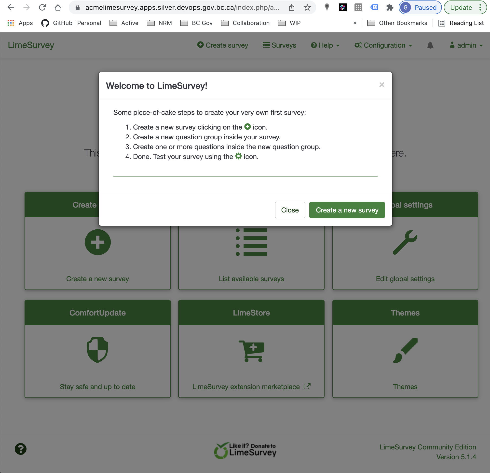

### Table of Contents

<!-- TOC depthTo:2 -->

- [NRM LimeSurvey](#nrm-limesurvey)
  - [Prerequisites](#prerequisites)
  - [Files](#files)
  - [Build](#build)
    - [Custom Image](#custom-image)
  - [Deploy](#deploy)
    - [Database Deployment](#database-deployment)
    - [Application Deployment](#application-deployment)
      - [LimeSurvey installation](#limesurvey-installation)
    - [Log into the LimeSurvey app](#log-into-the-limesurvey-app)
  - [Example Deployment](#example-deployment)
    - [Example Database Deployment](#example-database-deployment)
    - [Example Application Deployment](#example-application-deployment)
    - [Log into the LimeSurvey app](#log-into-the-limesurvey-app-1)
  - [Using Environmental variables to deploy](#using-environmental-variables-to-deploy)
    - [Set the environment variables](#set-the-environment-variables)
    - [Database Deployment](#database-deployment-1)
    - [App Deployment](#app-deployment)
    - [Log into the LimeSurvey app](#log-into-the-limesurvey-app-2)
  - [FAQ](#faq)
  - [Versioning](#versioning)
  - [Unreleased](#unreleased)
    - [Added](#added)
    - [Changed](#changed)
    - [Removed](#removed)

<!-- /TOC -->

# NRM LimeSurvey

OpenShift templates for [LimeSurvey](https://github.com/LimeSurvey/LimeSurvey), used within Natural Resources Ministries and ready for deployment on [OpenShift](https://www.openshift.com/). [LimeSurvey](https://www.limesurvey.org/) is an open-source PHP application with a [PostgreSQL](https://www.postgresql.org/) relational database for persistent data.

## Prerequisites

For appropriate security on deployed pods:

- Kubernetes Network Policies should be in place, see the [Network Policy QuickStart](https://github.com/bcgov/how-to-workshops/tree/master/labs/netpol-quickstart) (note that [Aporeto](https://github.com/bcgov/networkpolicy-migration-workshop) is no longer support on BC Gov OpenShift)

For build:

- Administrator access to an [Openshift](https://console.apps.silver.devops.gov.bc.ca/k8s/cluster/projects) Project `*-tools` namespace
- the [oc](https://docs.openshift.com/container-platform/4.6/cli_reference/openshift_cli/getting-started-cli.html) CLI tool, installed on your local workstation
- access to this public [GitHub Repo](./)
- docker-pull-passthru secret referencing [artifactory credentials](https://developer.gov.bc.ca/Developer-Tools/Artifact-Repositories-(Artifactory))
```bash
oc -n <tools-namespace> create secret docker-registry docker-pull-passthru \
--docker-server=docker-remote.artifacts.developer.gov.bc.ca \
--docker-username=default-<namespace>-<random> \
--docker-password=<random> \
--docker-email=<git username>@<tools-namespace>.local
```

Once built, this image may be deployed to a separate `*-dev`, `*-test`, or `*-prod` namespace with the appropriate `system:image-puller` role.

For deployment:

- Administrator access to an [Openshift](https://console.apps.silver.devops.gov.bc.ca/k8s/cluster/projects) Project namespace
- the [oc](https://docs.openshift.com/container-platform/3.11/cli_reference/get_started_cli.html) CLI tool, installed on your local workstation
- access to this public [GitHub Repo](./)

Once deployed, any visitors to the site will require a modern browser (e.g. Edge, FF, Chrome, Opera etc.) with activated JavaScript (see official LimeSurvey [docs](https://manual.limesurvey.org/Installation_-_LimeSurvey_CE#Make_sure_you_can_use_LimeSurvey_on_your_website))

## Files

- [OpenShift LimeSurvey app template](ci/openshift/limesurvey-bcgov.dc.yaml) for LimeSurvey PHP application, with PostgreSQL Database
- [OpenShift Database service template](ci/openshift/postgresql.dc.yaml) for a PostgreSQL Database

## Build

### Custom Image

For a brand new build/image/imagestream/imagestreamtag in your new namespace, you would first create an image stream using this (forked) code (replace `<tools-namespace>` with your `*-tools` project namespace).

```bash
oc -n <tools-namespace> create istag limesurvey-bcgov:latest
oc -n <tools-namespace> process -f ci/openshift/limesurvey-bcgov.bc.yaml | oc -n <tools-namespace> apply -f -
oc -n <tools-namespace> start-build limesurvey-bcgov
```

Tag the built image stream with the correct release version, matching the `major.minor` release tag at the source [repo](https://github.com/LimeSurvey/LimeSurvey). For example, this v5.1.4 was tagged via:

```bash
oc -n <tools-namespace> tag limesurvey-bcgov:latest limesurvey-bcgov:5.1.4
```

NOTE: To update our LimeSurvey image, we would update or override the Dockerfile ARG, and run the [Build](./ci/openshift/limesurvey-bcgov.bc.yaml). For example, this v5.1.4 was built with:

```
ARG GITHUB_TAG=5.1.4+210824
```

## Deploy

### Database Deployment

Deploy the DB using the correct SURVEY_NAME parameter (e.g. an acronym that will be automatically prefixed to `limesurvey`):

```bash
oc -n <project> new-app --file=./ci/openshift/postgresql.dc.yaml -p SURVEY_NAME=<survey>
```

All DB deployments are based on the out-of-the-box [OpenShift Database Image](https://docs.openshift.com/container-platform/3.11/using_images/db_images/postgresql.html), and DB deployed objects (e.g. deployment configs, secrets, services, etc) have a naming convention of `<survey>limesurvey-postgresql` in the Openshift console.

### Application Deployment

Deploy the Application specifying:

- the survey-specific parameter (i.e. `<survey>`)
- your project `*-tools` namespace that contains the image, and
- a `@gov.bc.ca` email account that will be used with the `apps.smtp.gov.bc.ca` SMTP Email Server:

```bash
oc -n <project> new-app --file=./ci/openshift/limesurvey-bcgov.dc.yaml -p SURVEY_NAME=<survey> -p IS_NAMESPACE=<tools> -p ADMIN_EMAIL=<Email.Address>@gov.bc.ca
```

NOTE: The ADMIN_EMAIL is required, and you may also override the default ADMIN_USER and ADMIN_NAME. The ADMIN_PASSWORD is automatically generated by the template; be sure to __note the generated password__ (shown in the log output of this command on your screen).

Application deployed objects (e.g. deployment configs, secrets, services, etc) have a naming convention of `<survey>limesurvey-app` in the Openshift console.

#### LimeSurvey installation

The application is automatically done as part of the `docker-entrypoint.sh`, which calls `nrm-check-install.php` returning either:

- `NOINSTALL` (Database Connection is valid but LimeSurvey has not yet been installed), or
- `INSTALL` (LimeSurvey tables exist in the database)

If `NOINSTALL` is returned, then the script automatically runs:

```bash
php application/commands/console.php install "$ADMIN_USER" "$ADMIN_PASSWORD" "$ADMIN_NAME" "$ADMIN_EMAIL" verbose
```

</details>

### Log into the LimeSurvey app

Once the application has finished the initial install you may log in as the admin user (using the generated password). Use the correct Survey acronym in the URL:
`https://<survey>limesurvey.apps.silver.devops.gov.bc.ca/index.php/admin`

NOTE: The password is also stored as a secret in the OCP Console (`<survey>limesurvey-app.admin-password`), or can be echoed in the shell of deployed app terminal:

```bash
$ echo ${ADMIN_PASSWORD}
```

## Example Deployment

As a concrete example of a survey with the acronym `acme`, deployed in the project namespace `245e18-dev`, here are the steps:

<details><summary>Deployment Steps</summary>

### Example Database Deployment

```bash
❯ oc whoami
garywong-bc@github

❯ oc -n 245e18-dev new-app --file=./ci/openshift/postgresql.dc.yaml -p SURVEY_NAME=acme

--> Deploying template "245e18-dev/nrmlimesurvey-postgresql-dc" for "./ci/openshift/postgresql.dc.yaml" to project 245e18-dev

     * With parameters:
        * Survey Name=acme
        * Memory Limit=512Mi
        * PostgreSQL Connection Password=fSCMvcVj3MeAXwxL # generated
        * Database Volume Capacity=1Gi

--> Creating resources ...
    secret "acmelimesurvey-postgresql" created
    persistentvolumeclaim "acmelimesurvey-postgresql" created
    deploymentconfig.apps.openshift.io "acmelimesurvey-postgresql" created
    service "acmelimesurvey-postgresql" created
--> Success
    Application is not exposed. You can expose services to the outside world by executing one or more of the commands below:
     'oc expose service/acmelimesurvey-postgresql'
    Run 'oc status' to view your app.
```

### Example Application Deployment

After thirty seconds, the database pod should be up.

```bash
> oc -n 245e18-dev new-app --file=./ci/openshift/limesurvey-bcgov.dc.yaml -p IS_NAMESPACE=245e18-tools -p SURVEY_NAME=acme -p ADMIN_EMAIL=King.Kong@gov.bc.ca

--> Deploying template "245e18-dev/nrmlimesurvey-app-dc" for "./ci/openshift/limesurvey-bcgov.dc.yaml" to project 245e18-dev

     * With parameters:
        * Namespace=245e18-tools
        * Image Stream=limesurvey-bcgov
        * Version of LimeSurvey=5.1.4
        * LimeSurvey Acronym=acme
        * Upload Folder size=1Gi
        * Administrator Account Name=admin
        * Administrator Display Name=Administrator
        * Administrator Password=AhgMnt84y2vOXi3I # generated
        * Administrator Email Address=King.Kong@gov.bc.ca
        * Database Type=pgsql
        * CPU_LIMIT=200m
        * MEMORY_LIMIT=512Mi
        * CPU_REQUEST=50m
        * MEMORY_REQUEST=200Mi
        * REPLICA_MIN=2
        * REPLICA_MAX=3

--> Creating resources ...
    secret "acmelimesurvey-app" created
    persistentvolumeclaim "acmelimesurvey-app-upload" created
    persistentvolumeclaim "acmelimesurvey-app-config" created
    persistentvolumeclaim "acmelimesurvey-app-plugins" created
    deploymentconfig.apps.openshift.io "acmelimesurvey-app" created
    horizontalpodautoscaler.autoscaling "acmelimesurvey-app" created
    service "acmelimesurvey-app" created
    route.route.openshift.io "acmelimesurvey-app" created
--> Success
    Access your application via route 'acmelimesurvey.apps.silver.devops.gov.bc.ca'
    Run 'oc status' to view your app.
```

### Log into the LimeSurvey app

The Administrative interface is at:
https://acmelimesurvey.apps.silver.devops.gov.bc.ca/index.php/admin/

and brings to you a screen like:


Once logged as an Admin, you'll be brought to the Welcome page:


</details>

## Using Environmental variables to deploy

As this is a template deployment, it may be easier to set environment variable for the deployment, so using the same PROJECT `245e18-dev` and SURVEY `mas-test`:

<details><summary>Deployment Steps</summary>

### Set the environment variables

On a workstation logged into the OpenShift Console:

```bash
export TOOLS=245e18-tools
export PROJECT=245e18-dev
export SURVEY=mas-test
```

### Database Deployment

```bash
> oc -n ${PROJECT} new-app --file=./ci/openshift/postgresql.dc.yaml -p SURVEY_NAME=${SURVEY}

--> Deploying template "245e18-dev/nrmlimesurvey-postgresql-dc" for "./ci/openshift/postgresql.dc.yaml" to project 245e18-dev

     * With parameters:
        * Survey Name=mas-test
        * Memory Limit=512Mi
        * PostgreSQL Connection Password=c7fTOXpikaMCWfK3 # generated
        * Database Volume Capacity=1Gi

--> Creating resources ...
    secret "mas-testlimesurvey-postgresql" created
    persistentvolumeclaim "mas-testlimesurvey-postgresql" created
    deploymentconfig.apps.openshift.io "mas-testlimesurvey-postgresql" created
    service "mas-testlimesurvey-postgresql" created
--> Success
    Application is not exposed. You can expose services to the outside world by executing one or more of the commands below:
     'oc expose service/mas-testlimesurvey-postgresql'
    Run 'oc status' to view your app.
```

### App Deployment

Wait about 30 seconds, and/or confirm via the GUI that the DB is up:

```bash
> oc -n ${PROJECT} new-app --file=./ci/openshift/limesurvey-bcgov.dc.yaml -p SURVEY_NAME=${SURVEY} -p IS_NAMESPACE=${TOOLS} -p ADMIN_EMAIL=Joe.Smith@gov.bc.ca -p ADMIN_NAME="MAS LimeSurvey Administrator"

--> Deploying template "245e18-dev/nrmlimesurvey-app-dc" for "./ci/openshift/limesurvey-bcgov.dc.yaml" to project 245e18-dev

     * With parameters:
        * Namespace=245e18-tools
        * Image Stream=limesurvey-bcgov
        * Version of LimeSurvey=5.1.4
        * LimeSurvey Acronym=mas-test
        * Upload Folder size=1Gi
        * Administrator Account Name=admin
        * Administrator Display Name=MAS LimeSurvey Administrator
        * Administrator Password=dV0x1DuaBYjNhjCG # generated
        * Administrator Email Address=Joe.Smith@gov.bc.ca
        * Database Type=pgsql
        * CPU_LIMIT=200m
        * MEMORY_LIMIT=512Mi
        * CPU_REQUEST=50m
        * MEMORY_REQUEST=200Mi
        * REPLICA_MIN=2
        * REPLICA_MAX=3

--> Creating resources ...
    secret "mas-testlimesurvey-app" created
    persistentvolumeclaim "mas-testlimesurvey-app-upload" created
    persistentvolumeclaim "mas-testlimesurvey-app-config" created
    persistentvolumeclaim "mas-testlimesurvey-app-plugins" created
    deploymentconfig.apps.openshift.io "mas-testlimesurvey-app" created
    horizontalpodautoscaler.autoscaling "mas-testlimesurvey-app" created
    service "mas-testlimesurvey-app" created
    route.route.openshift.io "mas-testlimesurvey-app" created
--> Success
    Access your application via route 'mas-testlimesurvey.apps.silver.devops.gov.bc.ca'
    Run 'oc status' to view your app.
```

### Log into the LimeSurvey app

The Administrative interface is at https://${SURVEY}.apps.silver.devops.gov.bc.ca/index.php/admin/ which is this example is https://mas-testlimesurvey.apps.silver.devops.gov.bc.ca/ .

and brings to you a screen like:


Once logged as an Admin, you'll be brought to the Welcome page:


</details>

## FAQ

- to login the database, open the DB pod terminal (via OpenShift Console or `oc rsh`) and enter:

  `psql -U ${POSTGREQL_USER} ${POSTGRESQL_DATABASE}`

- to clean-up database deployments:

   `oc -n <project> delete secret/<survey>limesurvey-postgresql dc/<survey>limesurvey-postgresql svc/<survey>limesurvey-postgresql`

  NOTE: The Database Volume will be left as-is in case there is critical business data, so to delete:

  `oc -n <project> delete pvc/<survey>limesurvey-postgresql`

  or if using environment variables:

  ```bash
  oc -n ${PROJECT} delete secret/${SURVEY}limesurvey-postgresql dc/${SURVEY}limesurvey-postgresql svc/${SURVEY}limesurvey-postgresql
  oc -n ${PROJECT} delete pvc/${SURVEY}limesurvey-postgresql
  ```

- to clean-up application deployments:

  ```bash
  oc -n <project> delete secret/<survey>limesurvey-app dc/<survey>limesurvey-app svc/<survey>limesurvey-app route/<survey>limesurvey-app hpa/<survey>limesurvey-app`
  ```

  NOTE: The Configuration, Upload, and Plugins Volumes are left intact in case there are customized assets; if not (i.e. it's a brand-new survey):  

  ```bash
  oc -n <project> delete pvc/<survey>limesurvey-app-config pvc/<survey>limesurvey-app-upload pvc/<survey>limesurvey-app-plugins`
  ```

  or if using environment variables:

  ```bash
  oc -n ${PROJECT} delete secret/${SURVEY}limesurvey-app dc/${SURVEY}limesurvey-app svc/${SURVEY}limesurvey-app route/${SURVEY}limesurvey-app hpa/${SURVEY}limesurvey-app pvc/${SURVEY}limesurvey-app-config pvc/${SURVEY}limesurvey-app-upload pvc/${SURVEY}limesurvey-app-plugins
  ```

- to reset _all_ deployed objects (this will destroy all data and persistent volumes). Only do this on a botched initial install or if you have the DB backed up and ready to restore into the new wiped database.

  `oc -n <project> delete all,secret,pvc -l app=<survey>limesurvey`

  or if using environment variables:

  ```bash
  oc -n ${PROJECT} delete all,secret,pvc,hpa -l app=${SURVEY}limesurvey
  ```

- to dynamically get the pod name of the running pods, this is helpful:

  `oc -n <project> get pods | grep <survey>limesurvey-app- | grep -v deploy | grep Running | awk '{print \$1}'`

- to customize the deployment with higher/lower resources, using environment variables, use  these examples:

  ```bash
  oc -n ${PROJECT} new-app --file=./ci/openshift/postgresql.dc.yaml -p SURVEY_NAME=${SURVEY} -p MEMORY_LIMIT=768Mi -p DB_VOLUME_CAPACITY=1280M
  
  oc -n ${PROJECT} new-app --file=./ci/openshift/limesurvey.dc.yaml -p SURVEY_NAME=${SURVEY} -p ADMIN_EMAIL=John.Doe@gov.bc.ca -p ADMIN_NAME="IITD LimeSurvey Administrator" -p REPLICA_MIN=2
  ```

## Versioning

We use [SemVer](http://semver.org/) for versioning. For the versions available, see the [tags on this repository](https://github.com/your/project/tags).

## Unreleased

- add support for MySQL/MariaDB

### Added

- tested out build using newer version of LimeSurvey (via GITHUB_TAG), from the `/archive/refs/tags/*` of https://github.com/LimeSurvey/LimeSurvey
- refactored to use Dockerfile rather than git submodule
- after-the-fact tagged and created release for [first version](https://github.com/garywong-bc/nrm-survey/releases/tag/v3.15)
- implemented health checks for the deployments
- tested DB backup/restore and transfer
- updated `gluster-file-db` to `netapp-block-standard`
- updated `gluster-file` to `netapp-file-standard`
- check for persistent upload between re-deploys
- appropriate resource limits (multi-replica deployment supported)

### Changed
- 

### Removed
- 
